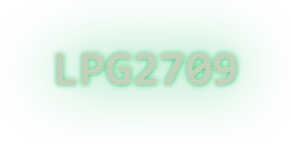

  

# Hi, I'm Leonardo 🧙

Graduated in computer engineering in 2021. I started programming at the age of 12 to develop games, but I ended up liking low-level computing.

- ⚙️ I’m currently working on **backend development and embedded computing**  
  
- 📖 Learning **emulators, compilers, computer vision, computer graphics, game/physics engine development and low-level stuff**  

### Stats

  

### Connect with me: 

  

  
  

	

  